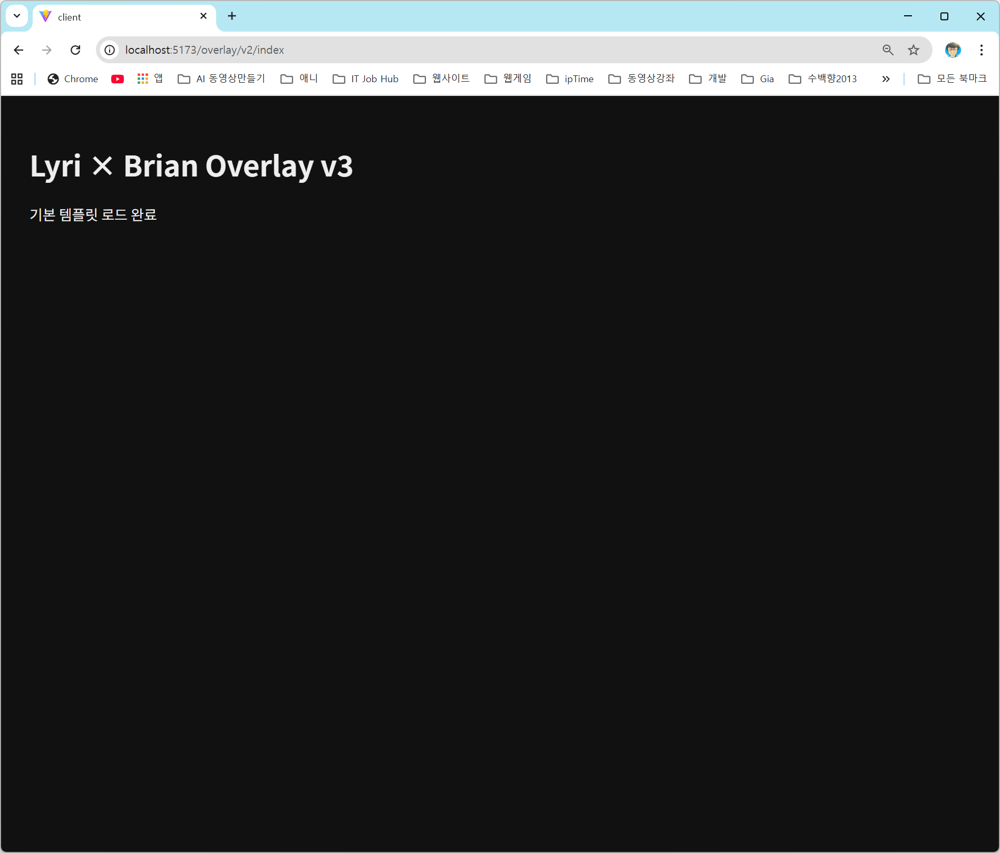

# 📘 Overlay v3 – server/ps 스크립트 사용법 가이드

이 문서는 `server/ps` 폴더 안에 포함된 4개의 자동 실행 스크립트 사용법을 정리한 가이드입니다.

---

## 📁 스크립트 위치

```
lyri-overlay-v3/
 └ server/
     └ ps/
         vite-start.ps1
         dev-both.ps1
         pm2-dev-start.ps1
         pm2-dev.config.js
```

---

# 1) 🚀 vite-start.ps1  
### **Vite Dev 서버 자동 종료 + 자동 실행**

### ✔ 기능
- 5173 포트에 기존 Vite dev 서버가 있으면 자동 종료  
- 새 Vite dev 서버 실행  
- 포트 충돌 방지  

### ✔ 사용법

```powershell
cd server/ps
.\vite-start.ps1
```
cd C:\lyri-overlay-v3\server\ps

# 1) 정책 계속 막힐 때(지금 상태)
powershell -ExecutionPolicy Bypass -File .\vite-start.ps1

# 2) 나중에 정책 풀어놨으면
.\vite-start.ps1

### ✔ 언제 사용하나?
- 프론트(UI) 작업 중일 때  
- 기존 dev 서버가 꼬였을 때  
- dev 서버가 중복 실행된 것 같을 때

---

# 2) 🟢 dev-both.ps1  
### **client + server 동시 실행 스크립트 (concurrently 역할)**

### ✔ 기능
- PowerShell을 2개 자동 실행  
  - 1번: client(dev) 실행  
  - 2번: server(index.js) 실행  
- 매번 두 개 실행할 필요 없음

### ✔ 사용법

```powershell
cd server/ps
.\dev-both.ps1
```

### ✔ 언제 사용하나?
- Overlay 개발의 기본 루틴  
- 프론트와 서버를 동시에 뜨게 하고 작업할 때

---

# 3) 🔄 pm2-dev-start.ps1  
### **PM2 개발모드 자동 재시작**

### ✔ 기능
- 서버(index.js)를 PM2로 watch 모드 실행  
- 파일 저장 → 자동 서버 재시작  
- 서버 에러 발생 → 자동 복구  
- 실서버/터널 테스트 시 안정성 확보

### ✔ 사용법

```powershell
cd server/ps
.\pm2-dev-start.ps1
```

또는 직접:

```powershell
pm2 start pm2-dev.config.js --watch
```

### ✔ 서버 종료

```powershell
pm2 stop overlay-v3-server
pm2 delete overlay-v3-server
```

---

# 4) ⚙ pm2-dev.config.js  
### **PM2 설정 파일**

### ✔ 기능
- PM2가 어떤 파일을 watch할지 정의  
- 실행 이름, 환경변수, 대상 파일 등 포함  
- pm2-dev-start.ps1에서 자동으로 사용됨

### ✔ 사용법
별도로 실행할 필요 없음.

---

# 🧙 리리소장의 추천 Routine

### ✔ 프론트 작업만 할 때
```
vite-start.ps1
```

### ✔ client + server 동시에 개발 (가장 자주 사용하는 루틴)
```
dev-both.ps1
```

### ✔ 서버 코드 자주 바꾸거나 안정성 필요할 때
```
pm2-dev-start.ps1
```

---

# 📌 참고
PowerShell 허가 문제 발생 시:

```powershell
Set-ExecutionPolicy -Scope CurrentUser RemoteSigned
```

---
```bash
powershell -ExecutionPolicy Bypass -File .\vite-start.ps1  
powershell -ExecutionPolicy Bypass -File .\dev-both.ps1  
powershell -ExecutionPolicy Bypass -File .\dev-both-stop.ps1  
powershell -ExecutionPolicy Bypass -File .\pm2-dev-start.ps1  
```


 
```
리리소장 배포 완료 완료!  
필요하면 이 사용법을 `server/ps/README.md` 로 자동 복사해주는 스크립트도 만들어줄게.
```

## PID 찾기
```bash
tasklist | findstr 40220
```

**[로컬]**
```
http://localhost:5173/overlay/v2/index
```


